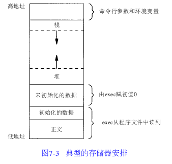
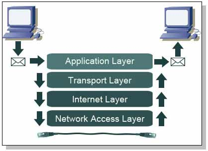

#Interview Preparation C ++ (1) Basics

1.  sizeof

    -   空类的sizeof为1

    -   虚表指针为4。一个类的虚函数所占用的地址是不变的，和虚函数的个数是没有关系的。

    -   普通的变量：是要占用内存的，但是要注意对齐原则（这点和struct类型很相似）。比如char对齐后占4字节

    -   static修饰的静态变量：不占用内容，原因是编译器将其放在全局变量区。

    -   子类的大小是本身成员变量的大小加上父类的大小。父类子类共享一个虚函数指针

2.  内联函数和宏指令

    -   宏

        1.  调用一个宏比调用一个函数更有效率。没有栈的开销

        2.  宏不能访问对象的私有成员

        3.  宏的定义很容易产生二意性。加括号来避免。

    -   内联函数和宏的区别

        1.  宏是由预处理器对宏进行替代，而内联函数是通过编译器控制来实现的

        2.  内联函数是真正的函数，只是在需要用到的时候，内联函数像宏一样的展开

        3.  在C++中，在类的内部定义了函数体的函数，被默认为是内联函数。任何在类的说明部分定义的函数都会被自动的认为是内联函数。

        4.  内联函数的参数类型和返回值类型在声明中都有明确的指定；而带参数宏定义的参数没有类型的概念，只有在宏展开以后，才由编译器检查语法，这就存在很多的安全隐患。

3.  继承

    -   为什么基类的析构函数是虚函数？

        1.  在实现多态时，当用基类操作派生类，在析构时防止只析构基类而不析构派生类的状况发生。

        2.  Declare destructors virtual in **polymorphic** base classes.

        3.  Make base class destructors public and virtual, or protected and
            nonvirtual.

    -   构造顺序

        1.  先执行虚拟继承的父类的构造函数，然后从左到右执行普通继承的父类的构造函数，然后按照定义的顺序执行数据成员的初始化，最后是自身的构造函数的调用。析构函数与之完全相反，互成镜像。

4.  内存

    -   内存分配

        1.  从静态存储区域分配。.data段

        2.  在栈上创建。在执行函数时，函数内局部变量的存储单元都可以在栈上创建，函数执行结束时这些存储单元自动被释放。栈内存分配运算内置于处理器的指令集中
            ，效率很高，但是分配的内存容量有限。

        3.  从堆上分配，亦称动态内存分配 。new，malloc

    -   内存空间，C++  
          

        

    -   子进程fork（）

        1.  子进程复制父进程的数据空间(数据段)、栈和堆，父、子进程共享正文段（二进制机器码）。

5.  模板

    -   类模板和函数模板

    -   特化

        1.  有时为了需要,针对特定的类型,需要对模板进行特化,也就是特殊处理.

    -   C++模板的偏特化与全特化

        1.  模板的偏特化是指需要根据模板的某些但不是全部的参数进行特化

        2.  类模板的匹配规则：最优化的优于次特化的，即模板参数最精确匹配的具有最高的优先权

        3.   函数模板的匹配规则：非模板函数具有最高的优先权

6.  线程和进程

    -   进程与线程的区别

        1.  基本：一个程序至少有一个进程,一个进程至少有一个线程.

        2.  地址空间和其它资源：进程间相互独立，同一进程的各线程间共享。某进程内的线程在其它进程不可见。

        3.  通信：进程间通信IPC，线程间可以直接读写进程数据段（如全局变量）来进行通信——需要进程同步和互斥手段的辅助，以保证数据的一致性。

        4.  调度和切换：线程上下文切换比进程上下文切换要快得多。

    -   线程与线程资源

        1.  线程占有的都是不共享的：栈   、 寄存器、 状态、 程序计数器

        2.  进程占有：（基本就是其他所有的东西）地址空间，全局变量，打开的文件，子进程，信号量，账户信息

    -   通讯

        1.  进程间通讯

            1.  关联进程实现进程间通信技术：继承资源（fork()）和命令行参数。

            2.  非关联进程实现进程间通信技术：管道(pipe).

                1.  匿名管道(关联进程)——借助于文件描述符实现(子进程从父进程继承了文件描述符);

                2.  命名管道(非关联进程)——具有某名字的特殊类型文件，可以建立一个IPC客户/服务器模型，可以跨网络访问命令管道。（命名管道常常用于多线程服务器。）

                3.  共享内存：实现进程间通信的一种方式。（通常使用共享内存比使用管道或队列更简单更有效。轻了常规文件访问的I/O操作代价）

                4.  动态数据交换(DDE)：当今最强大最完善的进程间通信形式之一。（使用消息传递、共享内存、事务协议、客户/服务器范例、同步规则以及会话协议来让数据和控制信息在进程间流动。）

        2.  线程间通讯

            1.  a.全局数据、b.全局变量、c.全局数据结构

            2.  d.线程间通信的参数（指向某个参数的指针） e.文件句柄

7.  设计原则

    -   RAII

        1.  定义

            1.  资源获取即初始化（Resource Acquisition Is
                Initialization），或称RAII。

            2.  将资源（被分配的内存、执行的线程、打开的套接字、打开的文件、被锁的互斥、数据库连接等——任何存在于受限供给中的事物）的生命周期绑定到一个对象的生存期。

        2.  特点

            1.  将每个资源封装入一个类，这里

                5.  构造函数请求资源，并建立所有类不变量或在它无法完成时抛出异常，

                6.  析构函数释放资源并决不抛出异常；

            2.  始终经由RAII类的实例使用满足要求的资源，该资源

                7.  自身拥有自动存储期或临时生存期，或

                8.  拥有绑定于自动或临时对象的生存期

        3.  拥有open()/close()、
            lock()/unlock()，或init()/copyFrom()/destroy()成员函数的类是非RAII类的典型的例子

        4.  标准库支持

            1.  C++标准库遵循RAII管理其自身资源：std::string、 std::vector、
                std::thread，以及多数其他类在构造函数（错误时抛出异常）中获取其资源，并在其析构函数（决不抛出）中释放它们，且不要求显式清理。

            2.  另外，标准库提供几种RAII包装器以管理用户提供的资源：  
                std::unique\_ptr及std::shared\_ptr用以管理动态分配的内存，或以用户提供的删除器管理任何以普通指针表示的资源；  
                std::lock\_guard、 std::unique\_lock、
                std::shared\_lock用以管理互斥。

    -   RTTI

    -   ADT

8.  排序

    -   快速排序

        1.  in-place实现方式

        2.  计算平均复杂度方法

            1.  最优，pivot处于[n/2]th位，即均分情况，O(nlogn)

            2.  最差，pivot处于[n-1]th位，即逆序情况，O(n\^2)

            3.  平均，pivot处于[0]\~[n-1]th位，即随机情况，由数学归纳法可以推出，O(nlogn)

    -   排序的复杂度、稳定性

| 排序方法                                     | 时间复杂度 | 空间复杂度 | 稳定性    |           |          |        |
|----------------------------------------------|------------|------------|-----------|-----------|----------|--------|
|                                              | 平均情况   | 最好情况   | 最坏情况  |           |          |        |
| 插入排序                                     | 直接插入   | O(n2)      | O(n)      | O(n2)     | O(1)     | 稳定   |
|                                              | Shell排序  | O(n1\~2)   | O(nlog2n) | O(n2)     | O(1)     | 不稳定 |
| 选择排序                                     | 直接选择   | O(n2)      | O(n2)     | O(n2)     | O(1)     | 不稳定 |
|                                              | 堆排序     | O(nlog2n)  | O(nlog2n) | O(nlog2n) | O(1)     | 不稳定 |
| 交换排序                                     | 冒泡排序   | O(n2)      | O(n)      | O(n2)     | O(1)     | 稳定   |
|                                              | 快速排序   | O(nlog2n)  | O(nlog2n) | O(n2)     | O(log2n) | 不稳定 |
| 归并排序                                     | O(nlog2n)  | O(nlog2n)  | O(nlog2n) | O(n)      | 稳定     |        |
| 基数排序                                     | O(d(n+r))  | O(d(n+r))  | O(d(n+r)) | O(n+rd)   | 稳定     |        |
| 注：1.希尔排序的时间复杂度和增量的选择有关。 |            |            |           |           |          |        |

9.  基数排序的复杂度中，r代表关键字的基数，d代表长度，n表示关键字的个数。

-   其他

1.  TCP/IP

    -   三次握手，四次挥手  
        

        

    -   TCP/IP的四层结构  
        

        

        1.  连接层负责建立电路连接，是整个网络的物理基础，典型的协议包括以太网、ADSL等等；

        2.  网络层负责分配地址和传送二进制数据，主要协议是IP协议；

        3.  传输层负责传送文本数据，主要协议是TCP协议；

        4.  应用层负责传送各种最终形态的数据，是直接与用户打交道的层，典型协议是HTTP、FTP等。

    -   OSI七层模型与TCP/IP四层模型对应

| OSI七层网络模型         | Linux TCP/IP四层概念模型 | 对应网络协议                            |
|-------------------------|--------------------------|-----------------------------------------|
| 应用层（Application）   | 应用层                   | TFTP, FTP, NFS, WAIS                    |
| 表示层（Presentation）  |                          | Telnet, Rlogin, SNMP, Gopher            |
| 会话层（Session）       |                          | SMTP, DNS                               |
| 传输层（Transport）     | 传输层                   | TCP, UDP                                |
| 网络层（Network）       | 网际层                   | IP, ICMP, ARP, RARP, AKP, UUCP          |
| 数据链路层（Data Link） | 网络接口                 | FDDI, Ethernet, Arpanet, PDN, SLIP, PPP |
| 物理层（Physical）      |                          | IEEE 802.1A, IEEE 802.2到IEEE 802.11    |

-   OSI是一个理论上的网络通信模型，而TCP/IP则是实际运行的网络协议。

-   一个打开页面的过程：
    用户上网输入网址--\>浏览器向DNS请求解析IP地址--\>域名系统DNS解析出服务器的IP地址--\>浏览器和服务器建立TCP连接--\>浏览器打包发送请求--\>服务器相应并返回文件--\>释放TCP连接--\>浏览器上显示页面
    可以看出，http协议和数据传输过程并没有太大关系，建立TCP连接（TCP协议才是传输层的协议）承担了这件事，http协议规定的是浏览器和服务器之间的报文。

-   TCP与UDP区别

    1.  TCP是面向连接的，UDP是无连接的。

    2.  TCP提供可靠的服务，数据无错误，不丢失，不重复，按顺序到达。UDP没有保证。

    3.  TCP面向字节流。UDP面向报文，UDP没有congestion control，适用于real-time
        transfer.

    4.  TCP连接是点对点的，UDP支持多对多通信。

    5.  TCP头部20字节，UDP头部8字节。

1.  STL

    -   STL算法通过重载operator()函数实现为模板类或模板函数。
